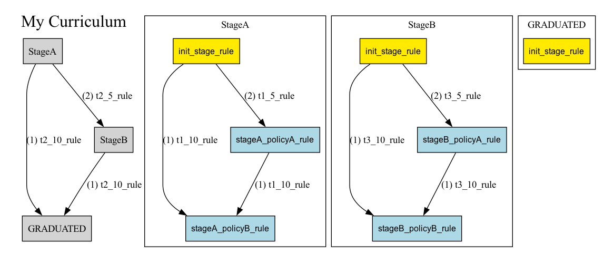
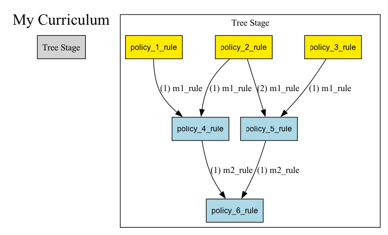
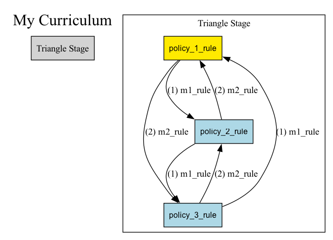
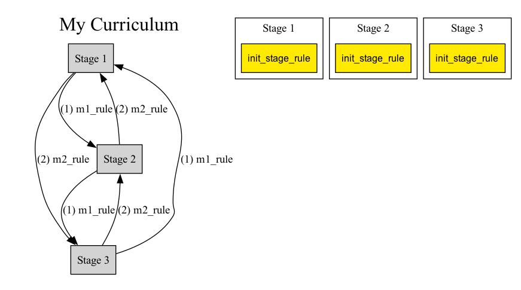

Getting started
===========================================

Installation
============

.. code:: bash

   pip install aind-behavior-curriculum

Documentation
=============

Understanding a Curriculum
--------------------------
A :py:class:`~aind_behavior_curriculum.curriculum.Curriculum`
is structured as a graph of training
:py:class:`~aind_behavior_curriculum.curriculum.Stage`.
Each :py:class:`~aind_behavior_curriculum.curriculum.Stage`
is associated with a :py:class:`~aind_behavior_curriculum.task.Task`,
which defines a set of configuration parameters via
:py:class:`~aind_behavior_curriculum.task.TaskParameters`.
Stages are connected by :py:class:`~aind_behavior_curriculum.curriculum.StageTransition`,
which are directed edges associated with a trigger condition.

:py:class:`~aind_behavior_curriculum.curriculum.Stage`
and :py:class:`~aind_behavior_curriculum.curriculum.StageTransition` form the nodes and edges of
a :py:class:`~aind_behavior_curriculum.curriculum.Curriculum`
graph, respectively. With this structure alone, a user can
define a basic curriculum with the flexibility of defining skip
connections and regressions. For nodes with multiple ongoing edges,
edges are labelled by priority, set by the user.

|High-Level Curriculum|

   *An example curriculum consisting of purely stages and stage
   transitions. This* :py:class:`~aind_behavior_curriculum.curriculum.Curriculum` *consists of a skip connection between* :py:class:`~aind_behavior_curriculum.curriculum.Stage` *'StageA* and :py:class:`~aind_behavior_curriculum.curriculum.Stage` *'Graduated'*.
   :py:class:`~aind_behavior_curriculum.curriculum.StageTransition` *are triggered on a parameter 't2' and the
   skip transition is ordered before the transition going to*
   :py:class:`~aind_behavior_curriculum.curriculum.Stage` *StageB.*

:math:`~`

This library also supports :py:class:`~aind_behavior_curriculum.curriculum.Curriculum` **hypergraphs**.

Conceptually, a user may want to change the task parameters associated
with a stage, but this set of task parameters would be unnatural to
classify as a new training stage altogether. In this situation, the user
may define a graph of :py:class:`~aind_behavior_curriculum.curriculum.Policy` and :py:class:`~aind_behavior_curriculum.curriculum.PolicyTransition`
within a :py:class:`~aind_behavior_curriculum.curriculum.Stage`
. A :py:class:`~aind_behavior_curriculum.curriculum.Policy`, changes the task parameters of
a :py:class:`~aind_behavior_curriculum.curriculum.Stage`
, as described above. A :py:class:`~aind_behavior_curriculum.curriculum.PolicyTransition` acts
just like a :py:class:`~aind_behavior_curriculum.curriculum.StageTransition`, and defines transitions between
:py:class:`~aind_behavior_curriculum.curriculum.Policy` on a trigger condition. Like :py:class:`~aind_behavior_curriculum.curriculum.StageTransition`,
:py:class:`~aind_behavior_curriculum.curriculum.PolicyTransition` can connect any two arbitrary
:py:class:`~aind_behavior_curriculum.curriculum.Policy` and are ordered by priority set by the user.

|Full Curriculum|

   *An example* :py:class:`~aind_behavior_curriculum.curriculum.Curriculum` *consisting of*
   :py:class:`~aind_behavior_curriculum.curriculum.Stage`
   *and* :py:class:`~aind_behavior_curriculum.curriculum.Policy`
   *graphs. Left: The high level policy graph. Right: Internal policy graphs.*

:py:class:`~aind_behavior_curriculum.curriculum.Policy` are more nuanced than :py:class:`~aind_behavior_curriculum.curriculum.Stage`.

Yellow :py:class:`~aind_behavior_curriculum.curriculum.Policy` in the example indicate '**Start Policies**'. To
initialize the task parameters of a :py:class:`~aind_behavior_curriculum.curriculum.Stage`
, the user must specify
which :py:class:`~aind_behavior_curriculum.curriculum.Policy` in the :py:class:`~aind_behavior_curriculum.curriculum.Stage`
policy graph to start with.

Unlike :py:class:`~aind_behavior_curriculum.curriculum.Stage`
, a mouse can occupy multiple active
:py:class:`~aind_behavior_curriculum.curriculum.Policy` within a :py:class:`~aind_behavior_curriculum.curriculum.Stage`
. As described later, the
:py:class:`~aind_behavior_curriculum.trainer.Trainer` will record the net combination of task parameters.

:math:`~`

**Any hypergraph is supported!**

Here are some examples of the possibilities. The high-level stage graph
are shown to the left and the individual policy graphs are shown to the
right.

|Tree Curriculum|

   *A 'Tree'* :py:class:`~aind_behavior_curriculum.curriculum.Curriculum`

|Track Curriculum|

   *A 'Track'* :py:class:`~aind_behavior_curriculum.curriculum.Curriculum`

|Policy Triangle Curriculum|

   *A 'Policy Triangle'* :py:class:`~aind_behavior_curriculum.curriculum.Curriculum`

|Stage Triangle Curriculum|

   *A 'Stage Triangle'* :py:class:`~aind_behavior_curriculum.curriculum.Curriculum`

:math:`~`

Understanding the Trainer
-------------------------

The :py:class:`~aind_behavior_curriculum.trainer.Trainer` is responsible for recording where a mouse is in its
associated curriculum hypergraph. The :py:class:`~aind_behavior_curriculum.trainer.Trainer` contains 4 primary
functions:

1) Registration: This is the entry point where the mice enter
the system. Here, the user provides the :py:class:`~aind_behavior_curriculum.trainer.Trainer` with a mouse and
associates the mouse with a curriculum, a start stage, and start
policies as a starting place for evaluation.

2) Evaluation: For each registered mouse, the :py:class:`~aind_behavior_curriculum.trainer.Trainer` looks at
   the mouse's current position in its hypergraph curriculum. The
   :py:class:`~aind_behavior_curriculum.trainer.Trainer` collects all the current outgoing transitions and checks which evaluate to True. The :py:class:`~aind_behavior_curriculum.trainer.Trainer` determines the updated hypergraph position and associated :py:class:`~aind_behavior_curriculum.task.Task` parameters according to the following simple rules:

   -  :py:class:`~aind_behavior_curriculum.trainer.Trainer` takes the outgoing :py:class:`~aind_behavior_curriculum.trainer.Trainer` with
      the highest priority. If multiple :py:class:`~aind_behavior_curriculum.trainer.Trainer`
      evaluate to True, then the :py:class:`~aind_behavior_curriculum.trainer.Trainer` with the
      highest priority is chosen. Priority is set by the user.
   -  :py:class:`~aind_behavior_curriculum.trainer.Trainer` takes the outgoing :py:class:`~aind_behavior_curriculum.curriculum.PolicyTransition` with
      the highest priority. If multiple :py:class:`~aind_behavior_curriculum.curriculum.PolicyTransition`
      evaluate to True, then the :py:class:`~aind_behavior_curriculum.curriculum.PolicyTransition` with the
      highest priority is chosen. Priority is set by the user.
   -  :py:class:`~aind_behavior_curriculum.trainer.Trainer` override :py:class:`~aind_behavior_curriculum.curriculum.PolicyTransition`. If
      a :py:class:`~aind_behavior_curriculum.trainer.Trainer` and :py:class:`~aind_behavior_curriculum.curriculum.PolicyTransition` both
      evaluate to True, the :py:class:`~aind_behavior_curriculum.trainer.Trainer` jumps directly to the next
      :py:class:`~aind_behavior_curriculum.curriculum.Stage`.
   -  If no transitions are True, the mouse stays in place.
   -  For multiple active :py:class:`~aind_behavior_curriculum.curriculum.Policy` that evaluate to True,
      :py:class:`~aind_behavior_curriculum.trainer.Trainer` sets the current :py:class:`~aind_behavior_curriculum.task.Task` parameters to the
      net combination of incident :py:class:`~aind_behavior_curriculum.curriculum.Policy`.

3) Mouse Override: This allows the user to update a mouse's position
   manually to any position in its curriculum. Future evaluation occurs
   from this new position. Due to this feature, it is possible to design
   a :py:class:`~aind_behavior_curriculum.curriculum.Curriculum`
   of 'floating stages' and 'floating policies'.

4) Mouse Eject: This allows the user to remove a mouse from its
   curriculum entirely. The position of the mouse is recorded as 'None'
   and stays at 'None' on future evaluation unless the mouse is
   overrides back onto curriculum.

Every :py:class:`~aind_behavior_curriculum.trainer.Trainer` function keeps a record of mouse history in
:py:class:`~aind_behavior_curriculum.trainer.SubjectHistory` which can be referenced or exported for task
automation and further analysis.

:math:`~`

Building a Curriculum
---------------------

For examples of how to build a :py:class:`~aind_behavior_curriculum.curriculum.Curriculum`,
please reference examples/example_project and examples/example_project_2 within
the project files and their associated diagrams, examples/example_project/diagrams and examples/example_project_2/diagrams.

Tips for building your own :py:class:`~aind_behavior_curriculum.curriculum.Curriculum`:

- Focus on one graph at a time. Define all the **Tasks/Stages/Stage Transitions** associated
  with the higher level graph, and then move onto defining the
  **Policies/Policy Transitions/Start Policies** associated with each :py:class:`~aind_behavior_curriculum.curriculum.Stage`.

- :py:class:`aind_behavior_curriculum.curriculum.Metrics` contains all the variables that trigger conditions
  associated with :py:class:`~aind_behavior_curriculum.trainer.Trainer` and :py:class:`~aind_behavior_curriculum.curriculum.PolicyTransition`.
  Progressively add to :py:class:`aind_behavior_curriculum.curriculum.Metrics` as needed.

- Keep :py:class:`~aind_behavior_curriculum.curriculum.StageTransition` and :py:class:`~aind_behavior_curriculum.curriculum.PolicyTransition` simple.
  A typical transition will only trigger on one metric variable. This
  makes transitions much easier to name.

- Validate :py:class:`~aind_behavior_curriculum.curriculum.StageTransition` and :py:class:`~aind_behavior_curriculum.curriculum.PolicyTransition`
  priority with the :py:meth:`~aind_behavior_curriculum.curriculum.Curriculum.export_diagram` utility, which
  labels edges with its rank. Use
  :py:meth:`~aind_behavior_curriculum.curriculum.Curriculum.set_stage_transition_priority` and
  :py:meth:`~aind_behavior_curriculum.curriculum.Stage.set_policy_transition_priority` to reorder priority.

Common mistakes:

- Every :py:class:`~aind_behavior_curriculum.curriculum.Stage` needs a set of start policies, see :py:meth:`~aind_behavior_curriculum.curriculum.Stage.set_start_policies`.
  If a stage with no policies is desired, use :py:meth:`~aind_behavior_curriculum.curriculum_utils.create_empty_stage`.
  This is a common pattern for the final stage of a :py:class:`~aind_behavior_curriculum.curriculum.Curriculum`,
  so the library also offers a prebuilt final stage :py:class:`~aind_behavior_curriculum.curriculum_utils.GRADUATED`.

-  The :py:class:`~aind_behavior_curriculum.curriculum.Rule` callables in :py:class:`~aind_behavior_curriculum.curriculum.Policy`,
   :py:class:`~aind_behavior_curriculum.curriculum.PolicyTransition`, and
   :py:class:`~aind_behavior_curriculum.curriculum.StageTransition` have different input
   signatures. Please reference the corresponding validate_rule(...) in the documentation.
   (Policy) :py:meth:`~aind_behavior_curriculum.curriculum.Policy.validate_rule`
   (PolicyTransition) :py:meth:`~aind_behavior_curriculum.curriculum.PolicyTransition.validate_rule`
   (StageTransition) :py:meth:`~aind_behavior_curriculum.curriculum.StageTransition.validate_rule`

:math:`~`

A word on :py:class:`~aind_behavior_curriculum.curriculum.Metrics`
------------------------------------------------------------------

:py:class:`~aind_behavior_curriculum.curriculum.Metrics` used in the curriculum should follow the following general principles:

- :py:class:`~aind_behavior_curriculum.curriculum.Metrics` should be simple and cheap to calculate. A :py:class:`~aind_behavior_curriculum.curriculum.Metrics` should represent a
  collection of variables that can be used to trigger a :py:class:`~aind_behavior_curriculum.trainer.StageTransition` or :py:class:`~aind_behavior_curriculum.curriculum.PolicyTransition`.
  For example, a metric could be 'time spent in stage', 'distance traveled', or 'number of licks'.

- :py:class:`~aind_behavior_curriculum.curriculum.Metrics` should be calculated as soon as the data is acquired, ideally at the rig.

- While the calculation of these metrics will be largely up to the user, we strongly encourage users to maintain a single method that is used to solely return the populated model.
  This will make it easier to maintain and update the metrics as needed, without incurring in extra dependencies (e.g. plotting libraries, etc.).

Building a Trainer
------------------

The 4 primary functions of the :py:class:`~aind_behavior_curriculum.trainer.Trainer` described above are
decoupled from any database. To use the :py:class:`~aind_behavior_curriculum.trainer.Trainer` in practice, the
user must define :py:meth:`~aind_behavior_curriculum.trainer.Trainer.load_data` and
:py:meth:`~aind_behavior_curriculum.trainer.Trainer.write_data` which connect
to a user's databases for mice curriculum, mice history, and mice metrics.
Please see examples/example_project/trainer.py for an example.

:math:`~`

Inside Allen Institute of Neural Dynamics
-----------------------------------------

Allen Institute of Neural Dynamics offers an internal repository
template that automatically uploads the repository's curriculum to a
central bucket available here:
https://github.com/AllenNeuralDynamics/aind-behavior-curriculum-template
This way, curriculums can be accessed across rig computers and
reused/modified similar to Github commits.

As of (5/9/2024), a Metrics database has yet to be defined, therefore a
Trainer cannot be defined.

.. |High-Level Curriculum| image:: ../../examples/example_project/diagrams/high_level_curr_diagram.png

.. |Track Curriculum| image:: ../../examples/example_project_2/diagrams/track_curr_diagram.png

.. toctree::
   :maxdepth: 2
   :caption: Contents:

   self
   aind_behavior_curriculum
   Examples <https://github.com/AllenNeuralDynamics/aind-behavior-curriculum/tree/main/examples>

Indices and tables
==================

* :ref:`genindex`
* :ref:`modindex`
* :ref:`search`
