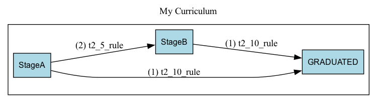
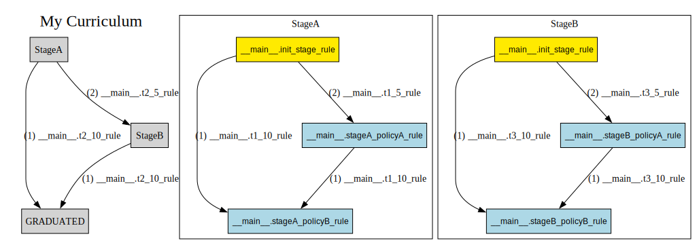
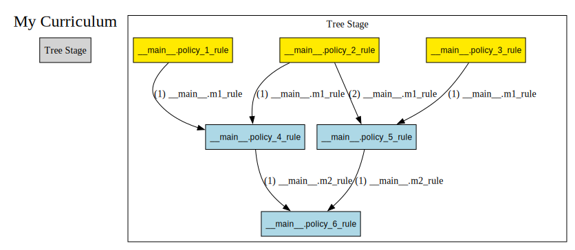
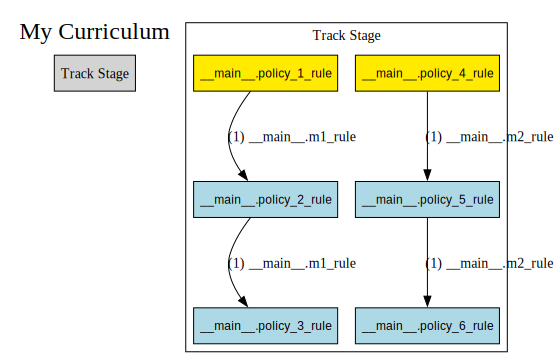
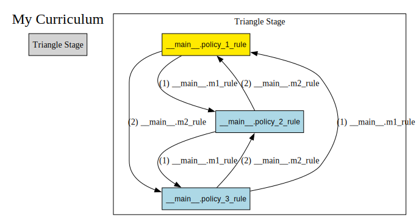
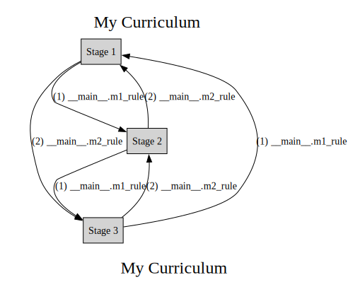

Getting started
===========================================

Installation
============

.. code:: bash

   pip install aind-behavior-curriculum

Documentation
=============

Understanding a Curriculum
--------------------------
A :py:class:`~aind_behavior_curriculum.curriculum.Curriculum`
is structured as a graph of training
:py:class:`~aind_behavior_curriculum.curriculum.Stage`.
Each :py:class:`~aind_behavior_curriculum.curriculum.Stage`
is associated with a :py:class:`~aind_behavior_curriculum.task.Task`,
which defines a set of configuration parameters via
:py:class:`~aind_behavior_curriculum.task.TaskParameters`. It is important to note that :py:class:`~aind_behavior_curriculum.curriculum.Stage` wraps an INSTANCE of :py:class:`~aind_behavior_curriculum.task.Task`, NOT the class itself. In other words, :py:class:`~aind_behavior_curriculum.curriculum.Stage` is a container for a :py:class:`~aind_behavior_curriculum.task.Task` that has been instantiated with a respective :py:class:`~aind_behavior_curriculum.task.TaskParameters`.

Stages are connected by :py:class:`~aind_behavior_curriculum.curriculum.StageTransition`,
which are directed edges associated with a trigger condition.

:py:class:`~aind_behavior_curriculum.curriculum.Stage`
and :py:class:`~aind_behavior_curriculum.curriculum.StageTransition` form the nodes and edges of
a :py:class:`~aind_behavior_curriculum.curriculum.Curriculum`
graph, respectively. With this structure alone, a user can
define a basic curriculum with the flexibility of defining skip
connections and regressions. For nodes with multiple ongoing edges,
edges are labelled by priority, set by the user.

|High-Level Curriculum|

   *An example curriculum consisting of purely stages and stage
   transitions. This* :py:class:`~aind_behavior_curriculum.curriculum.Curriculum` *consists of a skip connection between* :py:class:`~aind_behavior_curriculum.curriculum.Stage` *'StageA* and :py:class:`~aind_behavior_curriculum.curriculum.Stage` *'Graduated'*.
   :py:class:`~aind_behavior_curriculum.curriculum.StageTransition` *are triggered on a parameter 't2' and the
   skip transition is ordered before the transition going to*
   :py:class:`~aind_behavior_curriculum.curriculum.Stage` *StageB.*

:math:`~`

Stages are intended to represent 'checkpoint learning objectives', which wrap independent sets of parameters,
for example, Stage1 = {P1, P2, P3} -> Stage2 = {P4, P5, P6}.

If a curriculum demands changing the same set of parameters,
for example, Stage1 = {P1, P2, P3} -> Stage1' = {P1', P2', P3}, it is a good idea to use PolicyGraphs.

A PolicyGraph is a **parallel programming interface** for changing :py:class:`~aind_behavior_curriculum.curriculum.Stage` parameters.

|Full Curriculum|

   *An example* :py:class:`~aind_behavior_curriculum.curriculum.Curriculum` *consisting of*
   :py:class:`~aind_behavior_curriculum.curriculum.Stage`
   *and* :py:class:`~aind_behavior_curriculum.curriculum.Policy`
   *graphs. Left: The high level policy graph. Right: Internal policy graphs.*

|Track Curriculum|

   *A 'Track'* :py:class:`~aind_behavior_curriculum.curriculum.Curriculum`

:math:`~`

A PolicyGraph consists of :py:class:`~aind_behavior_curriculum.curriculum.Policy` nodes and :py:class:`~aind_behavior_curriculum.curriculum.PolicyTransition` directed edges.
Policies are user-defined functions that take in the current Stage :py:class:`~aind_behavior_curriculum.task.TaskParameters` and return the updated Stage :py:class:`~aind_behavior_curriculum.task.TaskParameters`.
PolicyTransitions define conditional execution of downstream Policies. Like :py:class:`~aind_behavior_curriculum.curriculum.StageTransition`, :py:class:`~aind_behavior_curriculum.curriculum.PolicyTransition`
can connect any two arbitrary :py:class:`~aind_behavior_curriculum.curriculum.Policy` and are ordered by priority set by the user.
The yellow polices indicate **Start policies**, which are entrypoint(s) into the PolicyGraph specified by the user.
Altogether, Policies and PolicyTransitions may be assembled to form arbitrary execution trees and loops.

Notably, PolicyGraph is executed in parallel (execution is done by the Trainer, discussed later).
A mouse may occupy multiple policies at once and will traverse down all trigger transitions returning True, similar to current in a circuitboard.
While a mouse can only occupy one Stage at a time, a mouse can and will often occupy many active policies.
Intuitively, the current state of Stage parameters is the net parameter change of all active policies.

Parallel execution has the benefit of supporting asynchronous parameter updates, which is a more natural way of defining parameter changes.
Rather than defining how all stage parameters all change as a group, a policy can instead define updates to individual parameters, which asynchronously trigger on different metrics.

A good example of using PolicyGraphs can be demonstrated in the 'Track' curriculum above.

Imagine 'Track Stage' manages two rig parameters, P1 and P2,and these rig parameters update independently from one another
according to different metrics, in this case, metrics m1 and m2 associated with m1_rule and m2_rule respectively.
With parallel execution, the most natural way of implementing this situation is with two tracks as shown, where a mouse can progress asynchronously along each parameter track.
If PolicyGraph was limited to serial execution, implementing this use case would be possible but more clumsy.
m1_rule and m2_rule would have to be combined into a compound policy transition and the left/right policies
would need to be combined into a compound policy with additional conditional logic inside checking if m1_rule or m2_rule was triggered.
With parallel execution, Policies and PolicyTransitions simplify into atomic operations.

Writing to PolicyGraph is easy.
Similar to Curriculum's API for adding, removing, and reordering stages,
Stage comes with a simple API for adding, removing, and reordering policies.
The structure of the high-level graph and the policy graphs can always be seen using :py:meth:`~aind_behavior_curriculum.curriculum.Curriculum.export_diagram`.

This library has been rigorously tested, and all combinations of StageGraph and PolicyGraph are supported.
Here are some more examples of the possibilities.
The high-level stage graph are shown to the left and the individual policy graphs are shown to the right.
All diagrams have been generated automatically from examples/example_project and examples/example_project_2.

|Tree Curriculum|

   *A 'Tree'* :py:class:`~aind_behavior_curriculum.curriculum.Curriculum`

|Policy Triangle Curriculum|

   *A 'Policy Triangle'* :py:class:`~aind_behavior_curriculum.curriculum.Curriculum`

|Stage Triangle Curriculum|

   *A 'Stage Triangle'* :py:class:`~aind_behavior_curriculum.curriculum.Curriculum`

:math:`~`

Understanding the Trainer and TrainerState
------------------------------------------

The :py:class:`~aind_behavior_curriculum.trainer.Trainer` holds the evaluation logic to suggest an update for the curriculum.'
Conceptually, it achieves this by evaluating the current state of the trainer (:py:class:` ~aind_behavior_curriculum.trainer.TrainerState`) and a compatible set of :py:class:`~aind_behavior_curriculum.curriculum.Metrics`. Calling the :py:class:`~aind_behavior_curriculum.trainer.Trainer.evaluate` method will return a new :py:class:`~aind_behavior_curriculum.trainer.TrainerState` with the updated mouse position and associated :py:class:`~aind_behavior_curriculum.task.TaskParameters`.

The evalution algorithm follows the following logic:

   -  :py:class:`~aind_behavior_curriculum.trainer.Trainer` takes the outgoing :py:class:`~aind_behavior_curriculum.curriculum.StageTransition` with
      the highest priority. If multiple :py:class:`~aind_behavior_curriculum.curriculum.StageTransition`
      evaluate to True, then the :py:class:`~aind_behavior_curriculum.curriculum.StageTransition` with the
      highest priority is chosen. Priority is set by the user using :py:meth:`~aind_behavior_curriculum.curriculum.Curriculum.set_stage_transition_priority`.
   -  :py:class:`~aind_behavior_curriculum.trainer.Trainer` takes the outgoing :py:class:`~aind_behavior_curriculum.curriculum.PolicyTransition` with
      the highest priority. If multiple :py:class:`~aind_behavior_curriculum.curriculum.PolicyTransition`
      evaluate to True, then the :py:class:`~aind_behavior_curriculum.curriculum.PolicyTransition` with the
      highest priority is chosen. Priority is set by the user using :py:meth:`~aind_behavior_curriculum.curriculum.Stage.set_policy_transition_priority`.
   -  :py:class:`~aind_behavior_curriculum.curriculum.StageTransition` overrides :py:class:`~aind_behavior_curriculum.curriculum.PolicyTransition`. If
      a :py:class:`~aind_behavior_curriculum.curriculum.StageTransition` and :py:class:`~aind_behavior_curriculum.curriculum.PolicyTransition` both
      evaluate to True, the :py:class:`~aind_behavior_curriculum.trainer.Trainer` jumps directly to the next
      :py:class:`~aind_behavior_curriculum.curriculum.Stage`.
   -  If no transitions are True, the mouse stays in place.
   -  For multiple active :py:class:`~aind_behavior_curriculum.curriculum.Policy` that evaluate to True,
      :py:class:`~aind_behavior_curriculum.trainer.Trainer` sets the current :py:class:`~aind_behavior_curriculum.task.Task` parameters to the
      net combination of incident :py:class:`~aind_behavior_curriculum.curriculum.Policy`.

Understanding the TrainerServer
------------------------------------------

.. warning::

   This feature is still under development and it is quite thin at the moment.

The :py:class:`~aind_behavior_curriculum.trainer.TrainerServer` wraps a :py:class:`~aind_behavior_curriculum.trainer.Trainer` and aims to provide an interface to manage the training of multiple subjects. It currently supports the following features:

1) Registration: This is the entry point where the mice enter
the system. Here, the user provides the :py:class:`~aind_behavior_curriculum.trainer.TrainerServer` with a mouse and
associates the mouse with a curriculum, a start stage, and start
policies as a starting place for evaluation.

2) Evaluation: For each registered mouse, the :py:class:`~aind_behavior_curriculum.trainer.TrainerServer` looks at
   the mouse's current position in its hypergraph curriculum. The wrapped :py:class:`~aind_behavior_curriculum.trainer.Trainer` collects all the current outgoing transitions and checks which evaluate to True.
   The :py:class:`~aind_behavior_curriculum.trainer.Trainer` determines the updated hypergraph position and associated :py:class:`~aind_behavior_curriculum.task.Task` parameters according to the following simple rules:

3) Mouse Override: This allows the user to update a mouse's position
   manually to any position in its curriculum. Future evaluation occurs
   from this new position. Due to this feature, it is possible to design
   a :py:class:`~aind_behavior_curriculum.curriculum.Curriculum`
   of 'floating stages' and 'floating policies'.

4) Mouse Eject: This allows the user to remove a mouse from its
   curriculum entirely. The position of the mouse is recorded as 'None'
   and stays at 'None' on future evaluation unless the mouse is
   overrides back onto curriculum.

:math:`~`

Building a Curriculum
---------------------

For examples of how to build a :py:class:`~aind_behavior_curriculum.curriculum.Curriculum`,
please reference examples/example_project and examples/example_project_2 within
the project files and their associated diagrams, examples/example_project/diagrams and examples/example_project_2/diagrams.

Tips for building your own :py:class:`~aind_behavior_curriculum.curriculum.Curriculum`:

- Focus on one graph at a time. Define all the **Tasks/Stages/Stage Transitions** associated
  with the higher level graph, and then move onto defining the
  **Policies/Policy Transitions/Start Policies** associated with each :py:class:`~aind_behavior_curriculum.curriculum.Stage`.

- :py:class:`aind_behavior_curriculum.curriculum.Metrics` contains all the variables that trigger conditions
  associated with :py:class:`~aind_behavior_curriculum.trainer.Trainer` and :py:class:`~aind_behavior_curriculum.curriculum.PolicyTransition`.
  Progressively add to :py:class:`aind_behavior_curriculum.curriculum.Metrics` as needed.

- Keep :py:class:`~aind_behavior_curriculum.curriculum.StageTransition` and :py:class:`~aind_behavior_curriculum.curriculum.PolicyTransition` simple.
  A typical transition will only trigger on one metric variable. This
  makes transitions much easier to name.

- Validate :py:class:`~aind_behavior_curriculum.curriculum.StageTransition` and :py:class:`~aind_behavior_curriculum.curriculum.PolicyTransition`
  priority with the :py:meth:`~aind_behavior_curriculum.curriculum.Curriculum.export_diagram` utility, which
  labels edges with its rank. Use
  :py:meth:`~aind_behavior_curriculum.curriculum.Curriculum.set_stage_transition_priority` and
  :py:meth:`~aind_behavior_curriculum.curriculum.Stage.set_policy_transition_priority` to reorder priority.

:math:`~`

A word on :py:class:`~aind_behavior_curriculum.curriculum.Metrics`
------------------------------------------------------------------

:py:class:`~aind_behavior_curriculum.curriculum.Metrics` used in the curriculum should follow the following general principles:

- :py:class:`~aind_behavior_curriculum.curriculum.Metrics` should be simple and cheap to calculate. A :py:class:`~aind_behavior_curriculum.curriculum.Metrics` should represent a
  collection of variables that can be used to trigger a :py:class:`~aind_behavior_curriculum.trainer.StageTransition` or :py:class:`~aind_behavior_curriculum.curriculum.PolicyTransition`.
  For example, a metric could be 'time spent in stage', 'distance traveled', or 'number of licks'.

- :py:class:`~aind_behavior_curriculum.curriculum.Metrics` should be calculated as soon as the data is acquired, ideally at the rig.

- While the calculation of these metrics will be largely up to the user, we strongly encourage users to maintain a single method that is used to solely return the populated model.
  This will make it easier to maintain and update the metrics as needed, without incurring in extra dependencies (e.g. plotting libraries, etc.).

Building a Trainer
------------------

The 4 primary functions of the :py:class:`~aind_behavior_curriculum.trainer.Trainer` described above are
decoupled from any database. To use the :py:class:`~aind_behavior_curriculum.trainer.Trainer` in practice, the
user must define :py:meth:`~aind_behavior_curriculum.trainer.Trainer.load_data` and
:py:meth:`~aind_behavior_curriculum.trainer.Trainer.write_data` which connect
to a user's databases for mice curriculum, mice history, and mice metrics.
Please see examples/example_project/trainer.py for an example.

:math:`~`

Declarative vs Imperative syntax
--------------------------------

The current version of the library is designed to be able to be used in a declarative or imperative manner.

Under the declarative paradigm, the user defines the `Task`(s) and `Curriculum` in a function-oriented syntax using:

- :py:func:`~aind_behavior_curriculum.task.create_task`
- :py:func:`~aind_behavior_curriculum.curriculum.create_curriculum`

Under a more imperative paradigm, the user can define the `Task` and `Curriculum` objects directly by inherting from these base classes.

For examples, see the `./examples` directory.

Inside Allen Institute of Neural Dynamics
-----------------------------------------

Allen Institute of Neural Dynamics offers an internal repository
template that automatically uploads the repository's curriculum to a
central bucket available here:
https://github.com/AllenNeuralDynamics/aind-behavior-curriculum-template
This way, curriculums can be accessed across rig computers and
reused/modified similar to Github commits.

As of (5/9/2024), a Metrics database has yet to be defined, therefore a
Trainer cannot be defined.

